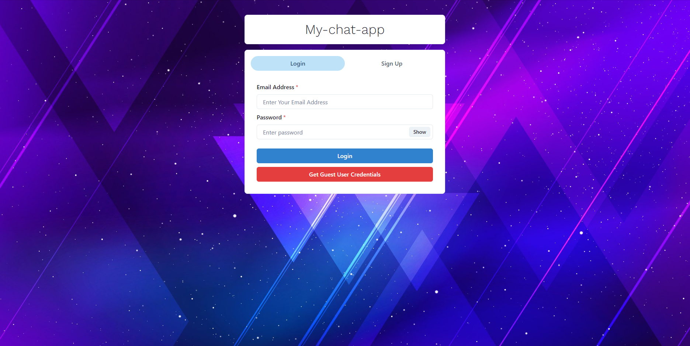
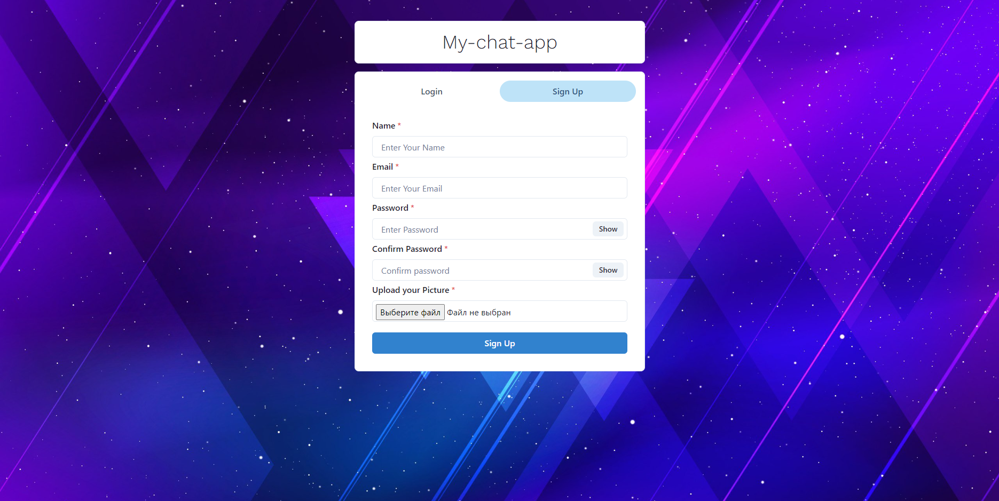
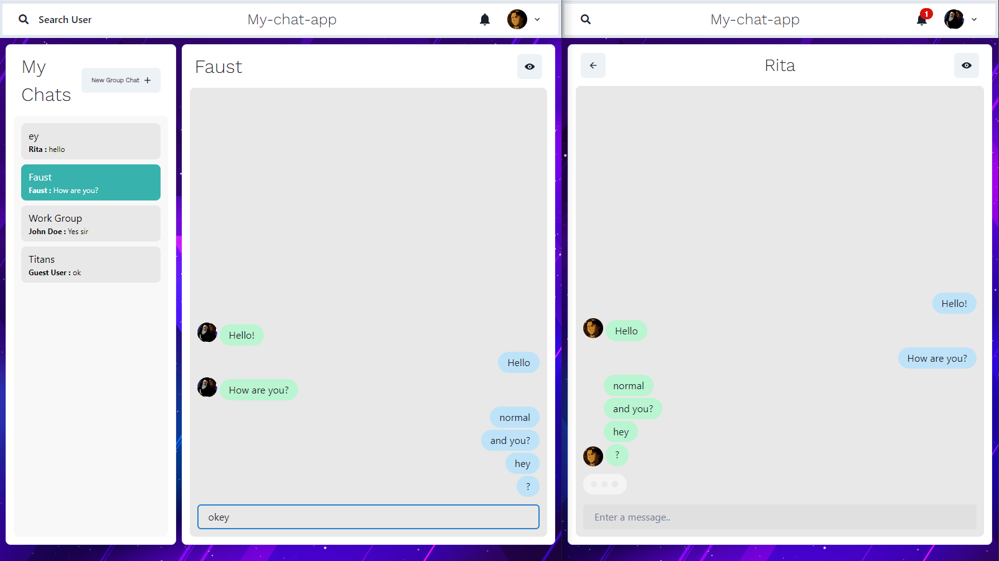
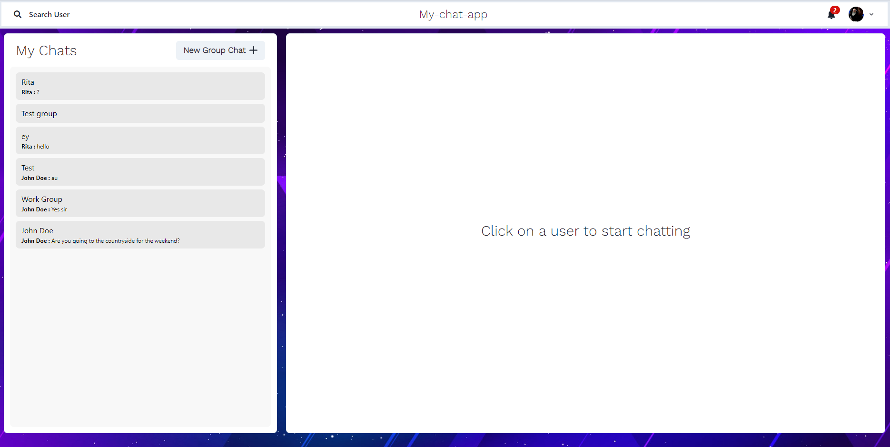
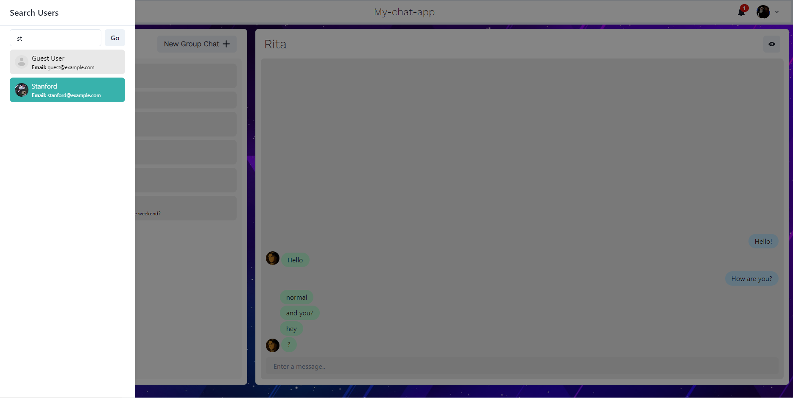
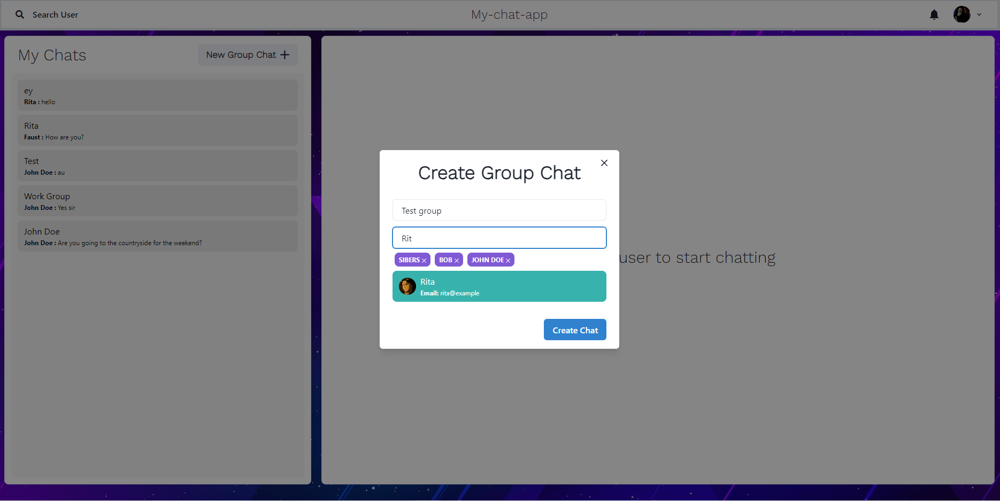
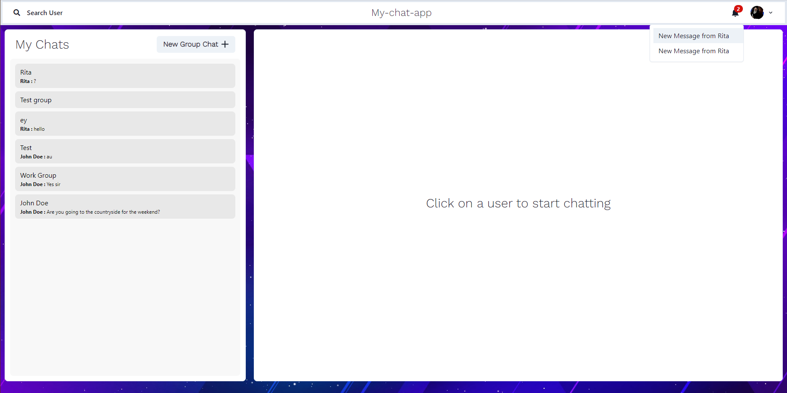
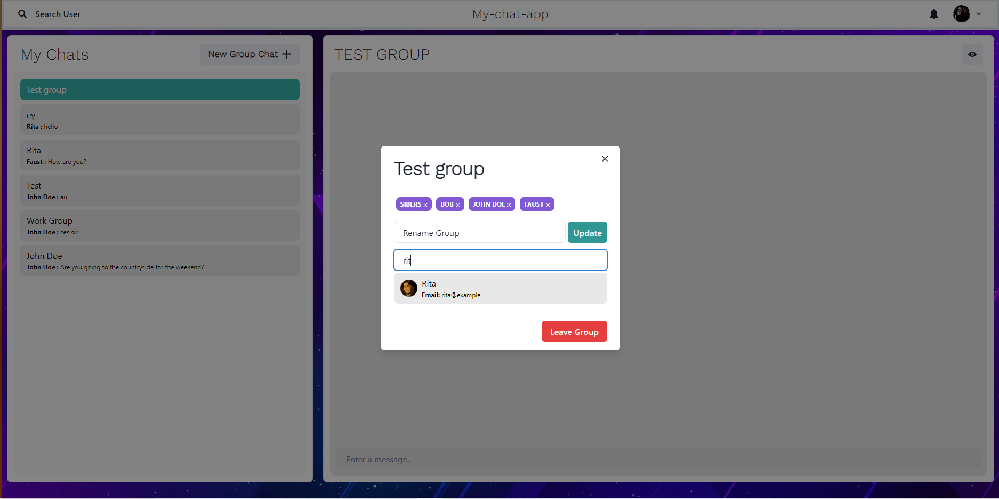
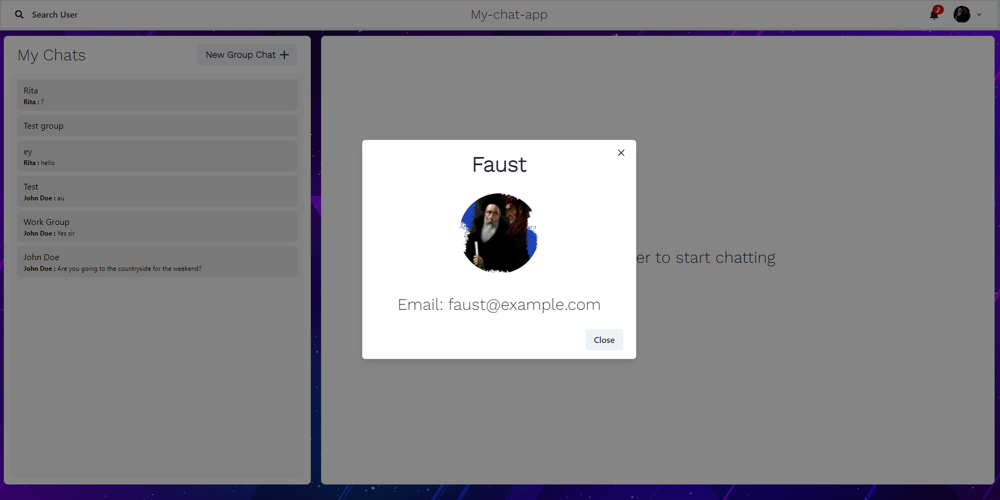

# My-chat-app

"My-chat-app" is a full-stack chatting application. It uses Socket.io for real-time communication and stores user details in an encrypted format in a MongoDB database.

## Tech Stack

**Client:** React JS

**Server:** Node JS, Express JS

**Database:** MongoDB

## Obtaining API Keys and Tokens

You need to register with cloudinary and take the necessary data from there for the 105th line of the Signup file.js https://api.cloudinary.com/v1_1/{Insert_your_username}/image/upload. In addition, you need to set your own values in .env PORT, MONGODB_URI, JWT_SECRET.

## Run Locally

Clone the project

```bash
  git clone https://github.com/Faust-Stars/my-chat-app
```

Go to the project directory

```bash
  cd my-chat-app
```

Install dependencies

```bash
  npm install
```

```bash
  cd frontend/
  npm install
```

Start the server

```bash
  npm run start
```

Start the Client

```bash
  //open now terminal
  cd frontend
  npm start
```

# Features

### Authenticaton




### Real-Time Chatting with Typing indicators and Adaptive



### One to One chat



### Search Users



### Create Group Chats



### Notifications



### Add or Remove users from group



### View Other user Profile



## Made By

- [@Faust-Stars](https://github.com/Faust-Stars)
